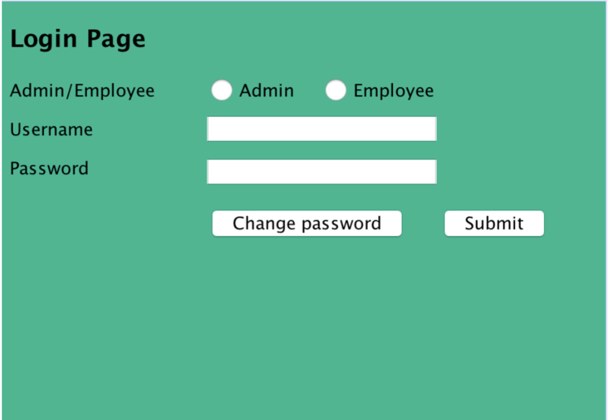

# Saree Retail Management System

## Table of Contents
- [Introduction](#introduction)
- [Defining the Problem](#defining-the-problem)
- [Proposed Solution](#proposed-solution)
- [Success Criteria](#success-criteria)
- [Application Windows](#application-windows)
- [Installation and Setup](#installation-and-setup)
- [Usage](#usage)
- [Contributing](#contributing)
- [License](#license)

## Introduction
This project entails developing a GUI-based software application tailored for Mrs. Kripa Shah, a small saree retail seller. The application's primary goal is to digitize and streamline the management of saree inventory, encompassing both pre-designed and customised sarees, while efficiently handling various business operations.

## Defining the Problem
Mrs. Kripa Shah's business model revolves around selling sarees, which includes managing a stock of pre-made sarees and coordinating their customization through designers. Her current business operations, especially inventory management and profit tracking, are manually handled, leading to inefficiencies and challenges as the business expands.

## Proposed Solution
In response to these challenges, a Java-based GUI application was developed, utilizing a SQLite database. This solution is crafted to digitally manage saree inventory and streamline business operations, enhancing both efficiency and accuracy. The application, developed using the NetBeans IDE, is designed for ease of use and is scalable for future adaptation to mobile platforms.

## Success Criteria
The application encompasses various features, such as:
- **Login Page**: Ensuring secure access for both admin and employees.
  
  
  
- **Inventory Management**: Facilitating the addition, editing, and deletion of inventory items.
  
  
  
- **Database for Inventory**: Providing robust storage for comprehensive inventory details.
  
  
  
- **Search Inventory**: Enabling inventory sorting and viewing by build.

  

- **Pricing and Billing**: Automating the calculation of selling prices, and the generation and printing of bills.

  

- **Employee Salary Calculation**: Computing monthly salaries of employees.

  

- **Profit Analysis**: Displaying annual and monthly profit figures.

  

## Application Windows
- **Data Flow Chart**

  

- **UML Diagram**

  

- **ER Diagram**

  

- **Home Page**

  

- **Inventory Table**

  

- **Order Saree Window**

  

## Installation and Setup
Detailed instructions for installing and setting up the application on your system.

## Usage
Guidelines on utilizing the application and its array of features.

## Contributing
Guidance for other developers interested in contributing to this project.

## License
Information regarding the licensing of the project.
